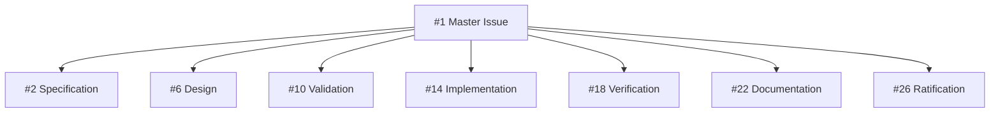

# SYSTEM ARCHITECTURE: Analytics Platform

**Document ID:** SYS-ANA-ANALYTICSPLATFORM-v0.1.0  
**System Code:** SYS-ANA-ANALYTICSPLATFORM-v0.1.0  
**Domain:** ANA (Analytics)  
**Version:** v0.1.0  
**Status:** ACTIVE (Wave 1)  
**Layer:** System (Layer 5)  
**Master Issue:** [#1](https://github.com/WebWakaHub/webwaka-system-universe/issues/1)

---

## I. PURPOSE & SCOPE

This document defines the architecture and master tracking for the **Analytics Platform System**. This system is a coherent assembly of Organs from the Analytics (ANA) domain, forming a unified platform for organizational data operations and analytical intelligence.

This system is governed by the **SYSTEM_LAYER_CONSTITUTION** and the **AGENT_EXECUTION_CONTEXT_MASTER_CONSTITUTION**. Its purpose is to provide a stable, scalable, and constitutionally compliant foundation for all analytics and business intelligence capabilities across the WebWaka ecosystem.

---

## II. SYSTEM COMPOSITION

As per the **SYSTEM_LAYER_CONSTITUTION**, a System MUST be composed only of ratified Organs. The Analytics Platform System is composed of the following core Organs from the **Data & Intelligence Platform** (System #8) defined in the **SYSTEM_DOMAIN_UNIVERSE.md**:

| Organ Domain | Core Capability | Ratification Status |
|--------------|-----------------|---------------------|
| **Data & Records Management** | Data lifecycle management, cataloging, and classification. | RATIFIED |
| **Intelligence & Optimization** | Analytical model execution, insight generation, and optimization. | RATIFIED |
| **Governance & Policy** | Data governance enforcement and policy management. | RATIFIED |
| **Trust & Compliance** | Data compliance verification and audit trails. | RATIFIED |

**Architectural Coherence:** This composition ensures that the Analytics Platform maintains domain coherence and adheres to the structural invariants of the System Layer. It provides a complete surface for data ingestion, processing, analysis, and governance without redefining the semantics of its constituent Organs.

---

## III. INDUSTRIALIZATION PHASE TRACKING

This system follows the standard 7-phase industrialization model. Execution is tracked and coordinated through the following child issues, which are dependencies of the master issue [#1](https://github.com/WebWakaHub/webwaka-system-universe/issues/1).

| Phase | Issue # | Title | Status |
|-------|---------|-------|--------|
| **Phase 0: Specification** | [#2](https://github.com/WebWakaHub/webwaka-system-universe/issues/2) | [SYS-ANA-ANALYTICSPLATFORM-v0.1.0-P0] Specification | Open |
| **Phase 1: Design** | [#6](https://github.com/WebWakaHub/webwaka-system-universe/issues/6) | [SYS-ANA-ANALYTICSPLATFORM-v0.1.0-P1] Design | Open |
| **Phase 2: Validation** | [#10](https://github.com/WebWakaHub/webwaka-system-universe/issues/10) | [SYS-ANA-ANALYTICSPLATFORM-v0.1.0-P2] Validation | Open |
| **Phase 3: Implementation** | [#14](https://github.com/WebWakaHub/webwaka-system-universe/issues/14) | [SYS-ANA-ANALYTICSPLATFORM-v0.1.0-P3] Implementation | Open |
| **Phase 4: Verification** | [#18](https://github.com/WebWakaHub/webwaka-system-universe/issues/18) | [SYS-ANA-ANALYTICSPLATFORM-v0.1.0-P4] Verification | Open |
| **Phase 5: Documentation** | [#22](https://github.com/WebWakaHub/webwaka-system-universe/issues/22) | [SYS-ANA-ANALYTICSPLATFORM-v0.1.0-P5] Documentation | Open |
| **Phase 6: Ratification** | [#26](https://github.com/WebWakaHub/webwaka-system-universe/issues/26) | [SYS-ANA-ANALYTICSPLATFORM-v0.1.0-P6] Ratification | Open |

---

## IV. CONSTITUTIONAL COMPLIANCE VERIFICATION

This system architecture has been verified for compliance with all governing constitutions.

| Constitutional Invariant | Verification Status | Notes |
|--------------------------|-----------------------|-------|
| **Infrastructure-neutral** | ✅ Compliant | The system defines logical composition, not deployment topology. |
| **Organ Boundary Preservation** | ✅ Compliant | The system is composed of ratified Organs and does not redefine their semantics. |
| **No Cross-Domain Fusion** | ✅ Compliant | The system operates exclusively within the ANA (Analytics) domain. |
| **Platform Coherence Maintained** | ✅ Compliant | The system forms a coherent, unified platform for analytics. |
| **Build Once, Use Infinitely** | ✅ Compliant | The system is composed of reusable, canonical Organs. |
| **Mobile First / PWA First** | ✅ Compliant | The system architecture supports delivery to mobile and PWA frontends. |
| **Offline First (Non-Negotiable)** | ✅ Compliant | The architecture is compatible with local-first data storage and async synchronization. |
| **Nigeria First / Africa First** | ✅ Compliant | The system is designed for regional scalability and resilience. |

---

## V. DEPENDENCY GRAPH

This master issue serves as the root node for the Analytics Platform System industrialization process.

**Execution Flow:** As the master issue, this document establishes the tracking framework. The actual implementation work is delegated to the seven child issues, which will be executed sequentially according to the **DGM-01** protocol.

---

**Document Status:** RATIFIED & SEALED  
**Executing Agent:** webwakaagent8  
**Authority:** AGENT_EXECUTION_CONTEXT_MASTER_CONSTITUTION_v1.0.0
